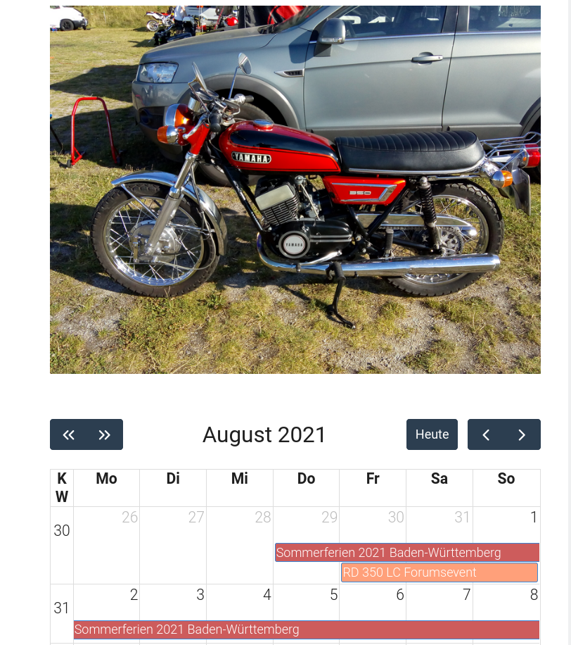

# Fullcalendar Plugin

The **Fullcalendar** Plugin is for [Grav CMS](http://github.com/getgrav/grav). It reads an ICS Calendar File and shows Events in a monthly Calendar Widget on your Page(s) - including Month Specific Image (if available):


## Installation

Installing the Fullcalendar plugin can be done in one of two ways. The GPM (Grav Package Manager) installation method enables you to quickly and easily install the plugin with a simple terminal command, while the manual method enables you to do so via a zip file.

### GPM Installation (Preferred)

The simplest way to install this plugin is via the [Grav Package Manager (GPM)](http://learn.getgrav.org/advanced/grav-gpm) through your system's terminal (also called the command line).  From the root of your Grav install type:

    bin/gpm install fullcalendar

This will install the Fullcalendar plugin into your `/user/plugins` directory within Grav. Its files can be found under `/your/site/grav/user/plugins/fullcalendar`.

### Manual Installation

To install this plugin, just download the zip version of this repository and unzip it under `/your/site/grav/user/plugins`. Then, rename the folder to `fullcalendar`. You can find these files on [GitHub](https://github.com/wernerjoss/grav-plugin-fullcalendar) or via [GetGrav.org](https://getgrav.org/downloads/plugins).

You should now have all the plugin files under

    /your/site/grav/user/plugins/fullcalendar
    
> NOTE: This plugin is a modular component for Grav which requires [Grav](http://github.com/getgrav/grav) and the [Error](https://github.com/getgrav/grav-plugin-error) and [Problems](https://github.com/getgrav/grav-plugin-problems) Plugins to operate.

### Admin Plugin

If you use the admin plugin, you can install directly through the admin plugin by browsing the `Plugins` tab and clicking on the `Add` button.

## Configuration

Before configuring this plugin, you should copy the `user/plugins/fullcalendar/fullcalendar.yaml` to `user/config/plugins/fullcalendar.yaml` and only edit that copy.  
Note that if you use the admin plugin, the file with your configuration, named fullcalendar.yaml will be saved in the `user/config/plugins/` folder once the configuration is saved in the admin.  
There is, however, no UI in the admin Backend that provides any customizations other than enable/disable - you will have to edit the config file to do that.

Here is the default configuration and an explanation of available options:

```yaml

enabled: true
colors: #3a87ad # see additional Note on custom colors in the Changelog
showlegend: false   # set to true to show calendar File Name(s) as Legend below grid
locale: en  # use your own locale here, e.g. de
weekNumbers: false  # set to true to show Week Numbers
cors_api_url: https://cors-anywhere.herokuapp.com/  # this is the default value, change if you like to use another

```

## Usage

Once installed and enabled, you can use this Plugin to parse ICS Calendar File(s) (these must be found in user/data/calendars and set as parameter in Plugin shortcode, without Path !) and display Events from that Calendar(s) anywhere on your Site using this shortcode:

    [fullcalendar icsfile="example0.ics,example1.ics,..."][/fullcalendar]
    
in the appropriate page (note the double quotes " surrounding the file name - single quotes ' will not work !)    
You can also provide absolute URL's to ICS Files, in which case a CORS proxy will be used to access them.  
As an addition, you can show a Picture for the current month above the calendar widget.  
Just put 12 Image Files named 'January.jpg', 'February.jpg', ... , 'December.jpg' in the Folder for your Page where the Calendar will be placed.
(Note that Image File names must match Month names according to your locale setting, so, for locale: de, use 'Januar.jpg' ...).  
From Version 0.2.6, it is also possible to just drop .ics Calendar Files into your page folder, they will be picked up and used like those in /user/data/calendars.  
In case you only use calendar files in the page folder, be sure to include an empty shortcut:   
` [fullcalendar][/fullcalendar]`   
in your page content, otherwise it will not work !  
However, this will only work if you use the calendar.html.twig template from the plugin for the calendar page (this can be done manually or in the admin backend by choosing 'Calendar' in the dropdown for the page template).  
The use of the calendar.html.twig template is also mandatory if you want to use the month picture feature of the plugin, otherwise you can also use other templates. 

## Advanced Usage:
As an addition to the standard use case, there is an elegant way to automate display of remote Calandars in case those are hosted on a CalDav Server (e.g. Owncloud, Nextcloud...):  
In this case, you can just use [caldav2ics](https://github.com/wernerjoss/wp-caldav2ics) via cron job to automatically update your ics Files shown by the Fullcalendar Plugin, so that remote Calendars, usually maintained in separate Calendar Apps (such as Google Calendar or Lightning) are automatically propagated to your Website.

## Credits

This Plugin is built on [fullcalendar.io](https://fullcalendar.io), [jakubroztocil/rrule](https://github.com/jakubroztocil/rrule) and [jsical](http://mozilla-comm.github.io/ical.js) - Javascript parser for rfc5545

## To Do

* Implement EXDATE/EXRULE rrule exceptions
* Upgrade included Fullcalendar.io to Version 5 (currently: Version 4)
